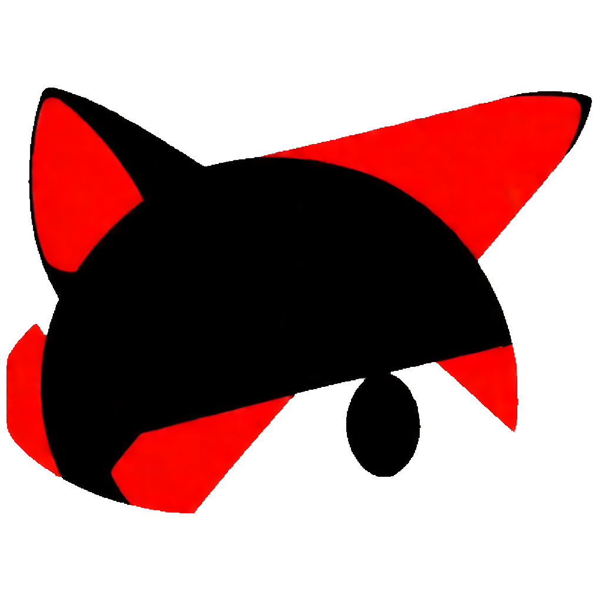

<div align="center" style="display:grid;place-items:center;">
<p>
    <a href="https://gitee.com/cryingn/vy-netcat" target="_blank"></a>
<h1>VY-netcat</h1>
</p>
</div>

# 介绍

**VY-netcat**是基于[vlang](https://vlang.io/)语言编写的一款网络工具, 主要用于CTF题目环境搭建, 将集成在[VTF比赛平台](https://gitee.com/cryingn/vtf), 相比较其他同类型工具, 主要将进行以下优化:

* [gnu-netcat](https://netcat.sourceforge.net/): 解决监听结束后无法继续保持的问题.

* [openbsd-netcat](https://man.openbsd.org/nc.1): 解决将执行命令发送的问题

# 开发情况

| 需求   | 解决情况 | 开发者        |
|:----:|:----:|:----------:|
| 帮助菜单 | 已解决  | sudopacman |
| 基础连接 | 已解决  | sudopacman |
| 设置端口 | 未解决  |            |
| 监听端口 | 未解决  |            |
| 保持监听 | 未解决  |            |

# 使用

您可以直接获取我们编译好的二进制文件进行使用, 或者通过vlang自行编译, 详细配置方法可以参考[vdoc](https://gitee.com/sakana_ctf/vdoc).

## 直接获取

```bash
wget https://gitee.com/cryingn/vy-netcat/archive/refs/tags/[版本号]
./nc -h
```

## 自行编译

```bash
git clone https://gitee.com/cryingn/vy-netcat.git
cd VY-netcat
make
cd bin
./nc -h
```

# VY许可证说明

在不进行个人补充的情况下VY许可证又称为VY通用许可证, 公开使用时只需标注社(VYCMa.png)标或声明源码来自VYCMa, 便可以免费修改和商用素材.
对于分发问题, 为方便更多人理解, 在VY许可证中有重新定义"版权转移"概念: 他人修改源码后可以闭源, 每个修改过的文件需放置版权说明, 如果要进行公开展示需标注作者个人的标志,若作者无特殊说明需标注社标(VYCMa.png)标或声明源码来自VYCMa.


