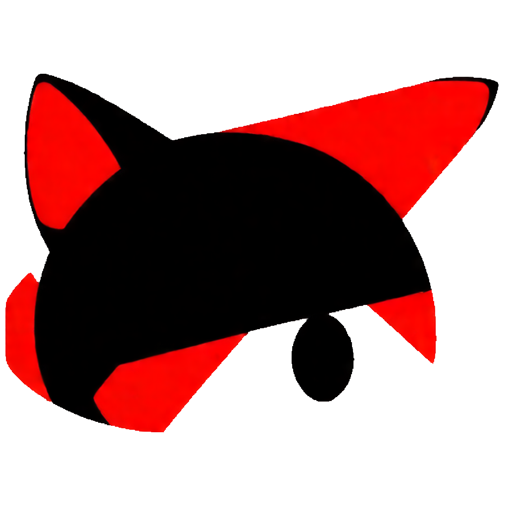

<div align="center" style="display:grid;place-items:center;">
<p>
    <a href="https://gitee.com/cryingn/vy-netcat" target="_blank"></a>
<h1>VY-netcat</h1>
</p>
</div>

# 语言

中文|[English](./README.md)

# 介绍

**VY-netcat**是基于[vlang](https://vlang.io/)语言编写的一款网络工具, 主要用于CTF题目环境搭建, 将集成在[VTF比赛平台](https://gitee.com/cryingn/vtf), 相比较其他同类型工具, 主要将进行以下优化:

* [gnu-netcat](https://netcat.sourceforge.net/): 解决监听结束后无法继续保持的问题.

* [openbsd-netcat](https://man.openbsd.org/nc.1): 解决将执行命令发送的问题

* 支持vim交互思路: `:q`退出; 并在之后继续完善`:wq`退出并保存数据, `:![本地指令]`不输出执行本地指令

* 支持linux交互: 记忆历史指令

# 开发情况

| 需求               | 解决情况 | 开发者        |
|:----------------:|:----:|:----------:|
| 帮助菜单             | 已解决  | sudopacman |
| 基础连接             | 已解决  | sudopacman |
| `nc [ip]:[port]`    | 已解决  | sudopacman  |
| 支持gcc编译          | 已解决  | sudopacman |
| 交叉编译             | 已解决  | sudopacman |
| 兼容windows         | 最低程度 | sudopacman |
| socket崩溃问题       | 已解决  | sudopacman |
| 指令执行             | 未解决  |            |
| 监听端口             | 已解决  | sudopacman |
| 保持监听             | 已解决  | sudopacman |
| `ctrl`+`C`退出     | 已解决  | sudopacman |
| 记忆历史指令           | 已解决  | sudopacman |
| `:wq`            | 未解决  |            |
| `:![本地指令]`       | 未解决  |            |
|  wiki页             | 未解决  |            |

# 使用

您可以直接获取我们编译好的二进制文件进行使用, 也可以通过vlang或gcc自行编译, 关于[vlang](https://vlang.io/)的详细配置方法可以参考[vdoc](https://gitee.com/sakana_ctf/vdoc).

## 直接获取

```bash
wget https://gitee.com/cryingn/vy-netcat/releases/download/[版本号]]/nc
./nc -h
```

## 自行编译

### Linux

详细的编译规则写在makefile中, 系统默认使用vlang进行编译, 当vlang编译失败时, 会自动切换到gcc进行编译.

```bash
git clone https://gitee.com/cryingn/vy-netcat.git
cd VY-netcat
make
cd bin
./nc -h
```

### Windows

**VY-netcat**最低程度支持了在windows环境使用, 考虑到不方便使用`make`, 单独写了**make.bat**文件提供编译:

```shell
git clone https://gitee.com/cryingn/vy-netcat.git
cd VY-netcat
./make
cd bin
./nc -h
```

# 帮助

以下为`help`中的说明.

```bash
[root_cn@archlinux bin]$ ./nc -h
VY-netcat v0.3.0, the network tools suitable for CTF.
Basic usages:
 connect to somewhere:  nc [addr] [port]
                        nc [addr]:[port]
 listen to somewhere:   nc -lp [port]
 keep to listen:        nc -klp [port]
CmdOptions:
 -h, --help                             display this help and exit.
 -e, --exec [shell]                     program to exec after connect.
 -lp, --listen_port [int]               listen the local port number.
 -klp, --keep_listen_port [int]         keep to listen the local port number.
 -s, --security {0, 1}                  set the security mode.
```

# 参与贡献

我们推荐使用vlang直接进行贡献, 在提交前请确保已经将文件编译到c(linux环境下), 我们提供了足够简便的方法用于检查:

```bash
make c
```

如果没有以下提示则表示vlang文件已经成功编译到c:

```bash
[warn] Unable to make to src/netcat.c
```

# VY许可证说明

在不进行个人补充的情况下VY许可证又称为VY通用许可证, 公开使用时只需标注社(VYCMa.png)标或声明源码来自VYCMa, 便可以免费修改和商用素材.

对于分发问题, 为方便更多人理解, 在VY许可证中有重新定义"版权转移"概念: 他人修改源码后可以闭源, 每个修改过的文件需放置版权说明, 如果要进行公开展示需标注作者个人的标志,若作者无特殊说明需标注社标(VYCMa.png)标或声明源码来自VYCMa.


